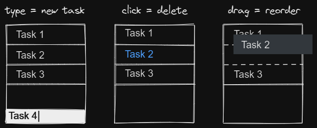

# Inwardmovement's Todo
A minimalist to-do list app: [inwardmovement-todo.netlify.app](https://inwardmovement-todo.netlify.app/)

## Usage
[Install with Chrome](https://support.google.com/chrome/answer/9658361)  
Zoom and resize the window in a corner of your screen.



## Develop
```
npm install
npm run dev
```

## Scope
Although I will consider suggestions and PRs, I made this app to suit my needs in terms of features and accessibility.

## To do
- PWA
- Refactor Sass
