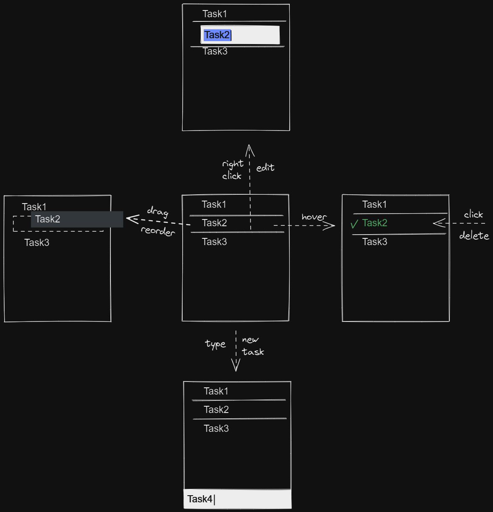

# Inwardmovement's Todo (not ready for release yet)
A minimalist to-do list app: [inwardmovement-todo.netlify.app](https://inwardmovement-todo.netlify.app/)

## Installation
[Install with Chrome](https://support.google.com/chrome/answer/9658361)

## Usage
1. (Recommended) Zoom and resize the window in a corner of your screen.
2. Commands
    - Write = new task
    - Drag = reorder
    - Right click = edit
    - Click = delete

## Accessibility
Not optimized for mobile, keyboard navigation, screen readers... but I will consider PRs solving that.

## Scope
- I may not add new features, but I will consider suggestions.
- Temporary list (no data storage).

## Prototype

